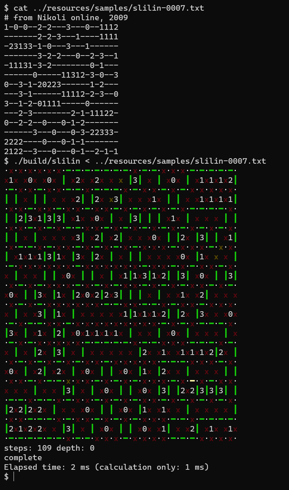
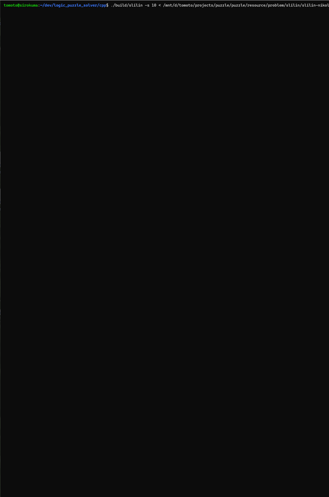

# 自動ペンシルパズルソルバー for スリザーリンク & ぬりかべ

* 「パズル通信ニコリ」のペンシルパズル「スリザーリンク」と「ぬりかべ」を自動的に解きます。特に「スリザーリンク」に力を入れており、「ぬりかべ」は仕掛かり中です。
* 自分が解く手筋をソフトウェアとして実装することを目指しています。人間向けに作られた盤面であれば相当高速に(10ms～100ms程度で)解くことができますが、数学的に完全な解法を提供するものではありません。
* ペンシルパズル盤面リーダー([logic_puzzle_reader](https://github.com/tomoto/logic_puzzle_reader))と連携することで、画像から盤面を読み取って解くこともできます。

 

## C++版

* これがメインの成果物です。
* 開発プラットフォームは WSL2 上の Linux (Ubuntu) + gcc を主とし、補助的に Windows + Visual Studio 2022 および Mac + gcc (Homebrew でインストール)での確認も行っています。

### ビルド方法

* gcc や Visual Studio をインストールし、cmake が使える環境を整えてください。
* Mac の場合は Homebrew で gcc と cmake をインストールしてください。

```

### gcc の場合

```
cd cpp
./build-gcc.sh
```

出力先は `cpp/build` です。

### Visual Studio の場合

Developer Command Prompt で次を実行します。`chcp 65001` で画面の文字コードを UTF-8 にしておいてください。

```
chcp 65001
cd cpp
build-vc.bat
```
出力先は `cpp/build/Release` です。

### 使用方法

実行:

```
slilin [-s <speed>] [-f {pretty|plain}] [-r] < <input file>
nurikabe [-s <speed>] < <input file>
```

* 入力は標準入力から与えます。ファイル名指定ではありません。
  * ビルドスクリプトの最後に呼び出し例が書かれているので参考にしてください。
  * 入力ファイルの形式は `resources/samples` のサンプルデータを参照してください。見れば一目瞭然です。
* オプション:
  * `-s | --speed <speed>`: 途中経過の出力頻度を指定します。小さい方が頻度が高く、0 は途中経過を出力しません。
  * `-f | --format {pretty|plain}`: 出力形式を指定します。`pretty` は色付きで見やすい出力、`plain` はASCII文字だけで出力します。`pretty` を使う場合、画面の文字コードは UTF-8 である必要があります。
  * `-r | --result-only`: 初期盤面も含め、最終解以外の出力を抑止します。

## NodeJS版

* スリザーリンクソルバーを実験的に TypeScript で実装したものです。

### ビルド方法

```
cd nodejs
npm i
npm run build
```

### 使用方法

`node build/src/slilin [-s <speed>] < <input file>`

## その他

* プログラミング言語(Modern C++ や TypeScript)の新しい機能をいろいろ触ってみたかったので、実験的なコードや統一性のないコードがランダムに含まれています。
* 基本的に、定石で詰まるまで解き進める ⇔ 仮説を立てて試すを繰り返し、仮説が破綻するごとに取り得る選択肢を狭めていく、という手順で解きます。仮説を立てて試す際には、深入りせずになるべく多くの情報を拾う(消しゴムをなるべく使わなくて済むようにする)ため、人間と同様の工夫を行ないます。
* 処理が冗長に見える部分がありますが、「これは要らないだろう」と思って取り除いたら解の探索速度がガタ落ちになることがあり、残しています。このへんは自分でもちゃんと説明できていません。
* まれに解けない盤面が見つかることがあり、そのたびに修正はしていますが、まだ完全に正しいとは言い切れません。自分でもちゃんと説明できていません。